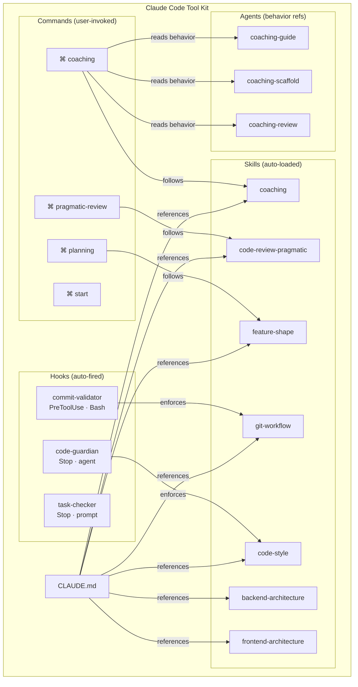
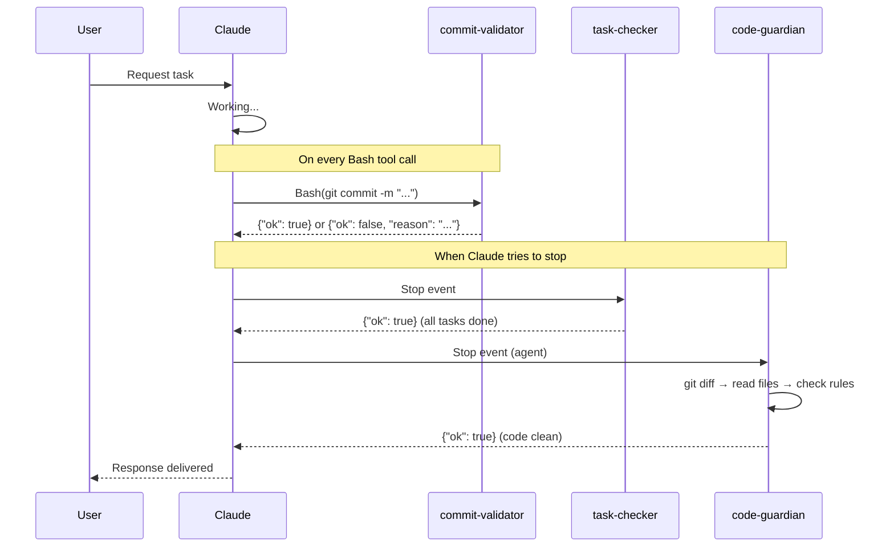

# Claude Code Tool Kit

Personal collection of skills, commands, agents, and configurations for Claude Code.

## Structure

```text
.
├── CLAUDE.md              # Main instructions & system prompt
├── commands/              # Slash commands (/start, /coaching, etc.)
│   ├── coaching.md
│   ├── planning.md
│   ├── pragmatic-review.md
│   └── start.md
├── agents/                # Specialized agent behaviors
│   ├── coaching-guide.md
│   ├── coaching-review.md
│   └── coaching-scaffold.md
├── hooks/                 # Claude Code hooks (injected into settings.json)
│   ├── hooks-config.json
│   └── prompts/
│       ├── commit-validator.txt
│       ├── task-checker.txt
│       └── code-guardian.txt
└── skills/                # Auto-loaded contextual skills
    ├── backend-architecture/
    ├── coaching/
    ├── code-review-pragmatic/
    ├── code-style/
    ├── feature-shape/
    ├── frontend-architecture/
    └── git-workflow/
```

## Skills

| Skill                   | Purpose                                                       |
| ----------------------- | ------------------------------------------------------------- |
| `backend-architecture`  | NestJS hexagonal/clean architecture patterns                  |
| `frontend-architecture` | React/Astro feature-based architecture                        |
| `code-style`            | TypeScript conventions (no semicolons, arrow functions, etc.) |
| `git-workflow`          | Branch strategy, atomic commits, PR workflow                  |
| `coaching`              | Guided development methodology (pair-programming partner)     |
| `feature-shape`         | Feature planning document format                              |
| `code-review-pragmatic` | Practical code review for solo devs/small teams               |

## Commands

| Command             | Purpose                                                   |
| ------------------- | --------------------------------------------------------- |
| `/start`            | Session startup - analyze context and propose next action |
| `/coaching`         | Start a guided implementation session                     |
| `/planning`         | Create Implementation Plan from Feature Shape             |
| `/pragmatic-review` | Pragmatic code review                                     |

## Agents

| Agent               | Purpose                                               |
| ------------------- | ----------------------------------------------------- |
| `coaching-scaffold` | Creates placeholder file pairs (impl + test)          |
| `coaching-guide`    | Analyzes context and provides guidance with examples  |
| `coaching-review`   | Code review before commit (logic, types, consistency) |

## Hooks

Hooks are injected into `~/.claude/settings.json` at install time (requires `jq`).

| Hook                | Event              | Type   | Purpose                                                  |
| ------------------- | ------------------ | ------ | -------------------------------------------------------- |
| `commit-validator`  | PreToolUse (Bash)  | prompt | Validates git commit format and rules                    |
| `task-checker`      | Stop               | prompt | Verifies Claude completed all tasks before stopping      |
| `code-guardian`     | Stop               | agent  | Reviews modified code against style rules                |

Prompt files are in `hooks/prompts/` and can be edited directly. Run `./install.sh` again to apply changes.

## Architecture

### Toolkit Overview



### Hook Execution Flow



## Installation

```bash
./install.sh
```

The script will:

- Copy skills to `~/.claude/skills/`
- Copy commands to `~/.claude/commands/`
- Copy agents to `~/.claude/agents/`
- Inject hooks into `~/.claude/settings.json` (requires `jq`)
- Copy CLAUDE.md to `~/.claude/`
- Ask before overwriting existing files
- Create an uninstall script at `~/.claude/uninstall-tool-kit.sh`

## Uninstall

```bash
~/.claude/uninstall-tool-kit.sh
```

## License

Personal use.
