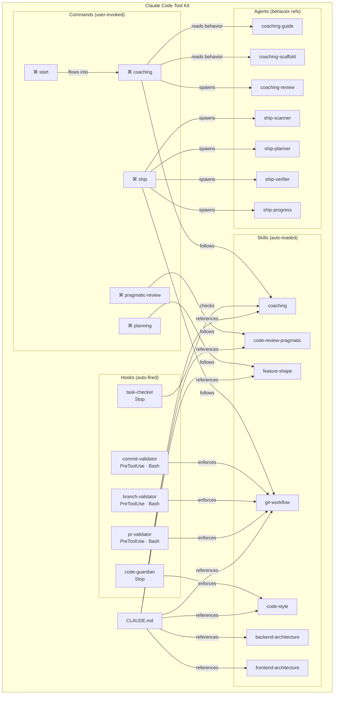
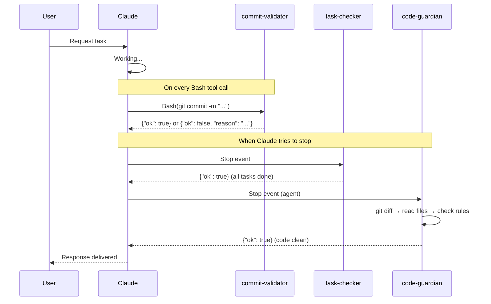

# Claude Code Tool Kit

Personal collection of skills, commands, agents, and configurations for Claude Code.

## Structure

```text
.
├── CLAUDE.md              # Main instructions & system prompt
├── commands/              # Slash commands (/start, /coaching, etc.)
│   ├── coaching.md
│   ├── planning.md
│   ├── pragmatic-review.md
│   ├── ship.md
│   └── start.md
├── agents/                # Specialized agent behaviors
│   ├── coaching-guide.md
│   ├── coaching-review.md
│   ├── coaching-scaffold.md
│   ├── ship-planner.md
│   ├── ship-progress.md
│   ├── ship-scanner.md
│   └── ship-verifier.md
├── hooks/                 # Claude Code hooks (Bun TS scripts)
│   ├── package.json
│   ├── tsconfig.json
│   ├── bun.lock
│   └── scripts/
│       ├── validators.ts       # Pure regex helpers (blocking layer, testable)
│       ├── validators.spec.ts  # Bun tests for the regex layer (repo-only)
│       ├── llm.ts              # Provider-pluggable LLM client (Anthropic / DeepSeek)
│       ├── commit-validator.ts
│       ├── branch-validator.ts
│       ├── pr-validator.ts
│       ├── task-checker.ts
│       └── code-guardian.ts
└── skills/                # Auto-loaded contextual skills
    ├── backend-architecture/
    ├── coaching/
    ├── code-review-pragmatic/
    ├── code-style/
    ├── feature-shape/
    ├── frontend-architecture/
    └── git-workflow/
```

## Skills

| Skill                   | Purpose                                                       |
| ----------------------- | ------------------------------------------------------------- |
| `backend-architecture`  | NestJS hexagonal/clean architecture patterns                  |
| `frontend-architecture` | React/Astro feature-based architecture                        |
| `code-style`            | TypeScript conventions (no semicolons, arrow functions, etc.) |
| `git-workflow`          | Branch strategy, atomic commits, PR workflow                  |
| `coaching`              | Guided development methodology (pair-programming partner)     |
| `feature-shape`         | Feature planning document format                              |
| `code-review-pragmatic` | Practical code review for solo devs/small teams               |

## Commands

| Command             | Purpose                                                   |
| ------------------- | --------------------------------------------------------- |
| `/start`            | Session startup — analyze context and propose next action |
| `/coaching`         | Start a guided implementation session                     |
| `/planning`         | Create Implementation Plan from Feature Shape             |
| `/pragmatic-review` | Pragmatic code review                                     |
| `/ship`             | Ship code — scan, commit, push, PR                        |

## Agents

| Agent               | Purpose                                                      |
| ------------------- | ------------------------------------------------------------ |
| `coaching-scaffold` | Creates placeholder file pairs (impl + test)                 |
| `coaching-guide`    | Analyzes context and provides guidance with examples         |
| `coaching-review`   | Code review before commit (logic, types, consistency)        |
| `ship-scanner`      | Scans changed files for convention violations                |
| `ship-planner`      | Plans atomic commit sequence from diff                       |
| `ship-verifier`     | Runs all verification checks (test, typecheck, lint, format) |
| `ship-progress`     | Proposes PROGRESS.md checkbox updates                        |

## Hooks

Hooks are Bun TypeScript scripts installed to `~/.claude/tool-kit-hooks/scripts/` and registered in
`~/.claude/settings.json` (requires `jq` and `bun`). They follow a **two-layer architecture**:

1. **Layer 1 — deterministic regex** (`validators.ts`): pure functions, zero I/O. This is the
   **blocking** layer. If a regex check fails, the hook denies the operation with a precise reason.
   Immune to LLM hallucination.
2. **Layer 2 — LLM advisory** (`llm.ts`): provider-pluggable LLM call. **Never blocks** — output is
   logged to `/tmp/<hook>.log` for observability. Hallucinations land in the log harmlessly.

The split keeps trivial structural rules (commit format, no semicolons, no `function` keyword)
deterministic and immune to LLM hallucination, while leaving subjective rules (description quality,
control-flow nuance) to a fail-safe LLM layer.

| Hook               | Event             | Layer 1 (regex, blocking)                                               | Layer 2 (LLM, advisory)                         |
| ------------------ | ----------------- | ----------------------------------------------------------------------- | ----------------------------------------------- |
| `commit-validator` | PreToolUse (Bash) | `type(scope): description` format, lowercase first, body, no signatures | description quality, body / diff alignment      |
| `branch-validator` | PreToolUse (Bash) | Rejects diminutifs (`feat/`), enforces `feature/*` or `fix/*`           | judges off-convention justifications when given |
| `pr-validator`     | PreToolUse (Bash) | PR title, labels, body, assignee, base branch                           | (none)                                          |
| `task-checker`     | Stop              | (none)                                                                  | Verifies Claude completed all tasks             |
| `code-guardian`    | Stop              | trailing `;`, `function` keyword, `.then()` chains                      | early-return / control-flow nuance              |

Scripts are in `hooks/scripts/` and can be edited directly. Run `./install.sh` again to apply
changes. The `*.spec.ts` test file is **not** propagated by `install.sh` — it stays in the repo.

### LLM provider

```bash
# default — Anthropic Haiku via Claude Max OAuth (~/.claude/.credentials.json)
LLM_PROVIDER=anthropic

# alternative — DeepSeek via API key (OpenAI-compatible /beta endpoint)
export LLM_PROVIDER=deepseek
export DEEPSEEK_API_KEY=sk-...
# optional: override the default 'deepseek-chat' model
export DEEPSEEK_MODEL=deepseek-chat
```

Both providers receive a JSON prefill (`{"`) to anchor strict JSON output regardless of context
language.

### Running the regex tests

```bash
cd hooks && bun test
```

The regex layer is the load-bearing piece — these tests cover the exact false positives observed in
production sessions. The LLM advisory layer is fail-open by design and is observed via the log files
rather than unit-tested.

## Architecture

### Toolkit Overview


```mermaid
graph TB
    subgraph "Claude Code Tool Kit"
        subgraph "Skills (auto-loaded)"
            S1[backend-architecture]
            S2[frontend-architecture]
            S3[code-style]
            S4[git-workflow]
            S5[coaching]
            S6[feature-shape]
            S7[code-review-pragmatic]
        end

        subgraph "Commands (user-invoked)"
            C1["⌘ start"]
            C2["⌘ planning"]
            C3["⌘ coaching"]
            C4["⌘ pragmatic-review"]
            C5["⌘ ship"]
        end

        subgraph "Agents (behavior refs)"
            A1[coaching-guide]
            A2[coaching-scaffold]
            A3[coaching-review]
            A4[ship-scanner]
            A5[ship-planner]
            A6[ship-verifier]
            A7[ship-progress]
        end

        subgraph "Hooks (auto-fired)"
            H1["commit-validator<br/>PreToolUse · Bash"]
            H2["branch-validator<br/>PreToolUse · Bash"]
            H3["pr-validator<br/>PreToolUse · Bash"]
            H4["task-checker<br/>Stop"]
            H5["code-guardian<br/>Stop"]
        end

        CFG[CLAUDE.md]
    end

    C1 -->|"flows into"| C3
    C3 -->|"reads behavior"| A1
    C3 -->|"reads behavior"| A2
    C3 -->|"spawns"| A3
    C3 -->|"follows"| S5
    C4 -->|"follows"| S7
    C2 -->|"follows"| S6

    C5 -->|"spawns"| A4
    C5 -->|"spawns"| A5
    C5 -->|"spawns"| A6
    C5 -->|"spawns"| A7
    C5 -->|"follows"| S4

    H1 -->|"enforces"| S4
    H2 -->|"enforces"| S4
    H3 -->|"enforces"| S4
    H4 -->|"checks"| S5
    H5 -->|"enforces"| S3

    CFG -->|"references"| S1 & S2 & S3 & S4 & S5 & S6 & S7
```

### Hook Execution Flow


```mermaid
sequenceDiagram
    participant U as User
    participant C as Claude
    participant CV as commit-validator
    participant TC as task-checker
    participant CG as code-guardian

    U->>C: Request task
    C->>C: Working...

    Note over C,CV: On every Bash tool call
    C->>CV: Bash(git commit -m "...")
    CV-->>C: {"ok": true} or {"ok": false, "reason": "..."}

    Note over C,CG: When Claude tries to stop
    C->>TC: Stop event
    TC-->>C: {"ok": true} (all tasks done)
    C->>CG: Stop event (agent)
    CG->>CG: git diff → read files → check rules
    CG-->>C: {"ok": true} (code clean)
    C-->>U: Response delivered
```

## Installation

```bash
./install.sh           # default: overwrite existing files silently
./install.sh --ask     # prompt before overwriting each existing file
./install.sh --help    # show usage
```

The script will:

- Copy skills to `~/.claude/skills/`
- Copy commands to `~/.claude/commands/`
- Copy agents to `~/.claude/agents/`
- Install hook TS scripts to `~/.claude/tool-kit-hooks/scripts/` and register in `settings.json`
  (requires `jq` and `bun`) — `*.spec.ts` test files stay in the repo
- Copy CLAUDE.md to `~/.claude/`
- Skip files that are already byte-identical to the source (logged as `Already up-to-date`)
- Create an uninstall script at `~/.claude/uninstall-tool-kit.sh`

## Uninstall

```bash
~/.claude/uninstall-tool-kit.sh
```

## License

Personal use.
